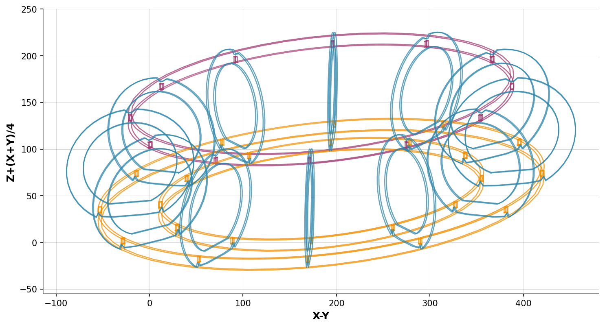
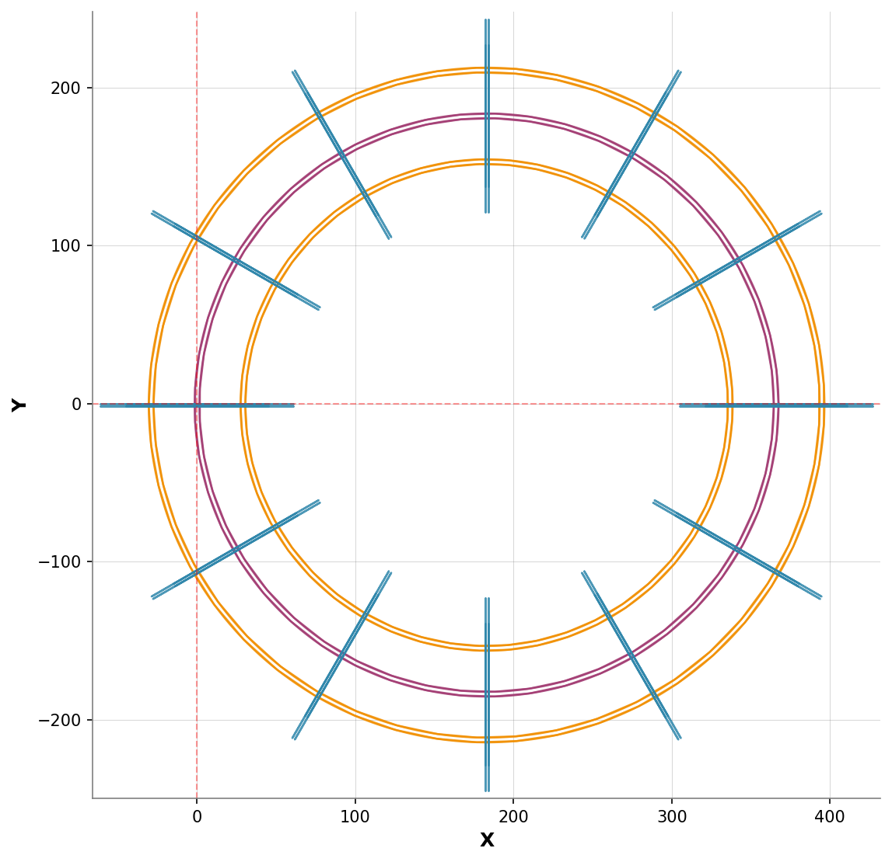

# Toroide 3D Model

This repository contains a 3D model of a toroide (torus/donut shape) created in Rhino 3D.

## 3D Model Views

<div align="center">

### Isometric View


<table>
  <tr>
    <td align="center">
      <strong>Top View</strong><br/>
      
    </td>
    <td align="center">
      <strong>Front View</strong><br/>
      
    </td>
    <td align="center">
      <strong>Right View</strong><br/>
      
    </td>
  </tr>
</table>

</div>

## Interactive 3D Viewing

To view this model interactively:

1. **Download the file**: [`240807_Toroide.3dm`](240807_Toroide.3dm)
2. **Online viewers**:
   - [3DViewer.net](https://3dviewer.net/) - Upload and view in browser
   - [Online 3D Viewer](https://viewer.3dprintcloud.com/) - Another web-based option
3. **Desktop software**:
   - Rhino 3D (native format)
   - FreeCAD (open source)
   - Blender (with import plugins)

## Model Information

| Property | Value |
|----------|-------|
| **Format** | Rhino 3D (.3dm) |
| **Last Updated** | 2024-12-19 |
| **Views Generated** | 2024-12-19 |
| **Type** | Parametric torus/donut shape |

## Files Structure

```
toroide/
├── 240807_Toroide.3dm          # Main 3D model file
├── images/                     # Rendered view images
│   ├── front.png              # Front orthographic view
│   ├── isometric.png          # Isometric (3/4) view
│   ├── right.png              # Right side orthographic view
│   └── top.png                # Top orthographic view
└── README.md                  # This documentation
```

## Technical Notes

- The model is created and maintained in **Rhino 3D**
- Static orthographic and isometric views are pre-rendered as PNG images
- For the best interactive experience, download the `.3dm` file and open in compatible software
- GitHub doesn't support native 3D file preview, but the static images provide comprehensive views

---

<div align="center">
<em>Documentation automatically updated on 2024-12-19</em><br/>
<em>🔄 This README is refreshed automatically when the 3D model changes</em>
</div>
