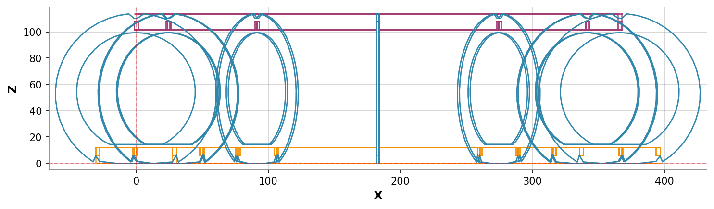

# Toroide

Toroide - FA 2026

## 3D Model Views

<div align="center">

### Isometric View


<table>
  <tr>
    <td align="center">
      <strong>Top View</strong><br/>
      
    </td>
    <td align="center">
      <strong>Front View</strong><br/>
      
    </td>
    <td align="center">
      <strong>Right View</strong><br/>
      
    </td>
  </tr>
</table>

</div>

## Files Structure

```
toroide/
├── ${MODEL_NAME}           # Main 3D model file
├── generate_3d_views.py         # View generation script
├── requirements.txt             # Python dependencies  
├── images/                      # Rendered view images
│   ├── front.png               # Front orthographic view
│   ├── isometric.png           # Isometric (3/4) view
│   ├── right.png               # Right side orthographic view
│   └── top.png                 # Top orthographic view
└── README.md                   # This documentation
```

## Technical Notes

- The model is created and maintained in **Rhino 3D**
- Views are automatically generated using **rhino3dm** Python library
- The `generate_3d_views.py` script extracts actual geometry from the 3DM file
- Static orthographic and isometric views are rendered as PNG images
- For the best interactive experience, download the `.3dm` file and open in compatible software
- GitHub doesn't support native 3D file preview, but the static images provide comprehensive views

## Local Development

To generate views locally:

```bash
# Create virtual environment
python -m venv venv
source venv/bin/activate  # On Windows: venv\Scripts\activate

# Install dependencies
pip install -r requirements.txt

# Generate views
python generate_3d_views.py --output images

# Force fallback torus (for testing)
python generate_3d_views.py --fallback
```

## Generation Details

- **View Generation**: Automated via GitHub Actions using rhino3dm library
- **Script**: `generate_3d_views.py` with proper 3DM geometry extraction
- **Rendering**: matplotlib with custom orthographic projections
- **Update Frequency**: Automatically triggered on model file changes
- **Fallback**: Creates sample torus if original geometry cannot be processed